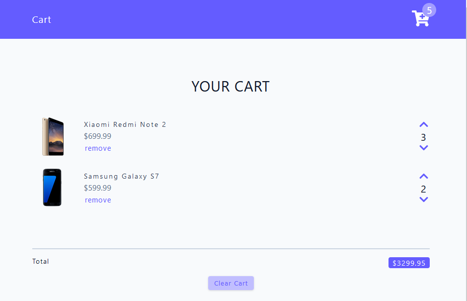

## Cart

A cart functionality where I learned how to work with useContext, useReducer, and make a loading spinner while fetching data.

### Installation

- Run
  ```bash
  npm install && npm run dev
  ```
- Then go to [http://localhost:5173](http://localhost:5173)

### Screenshot


