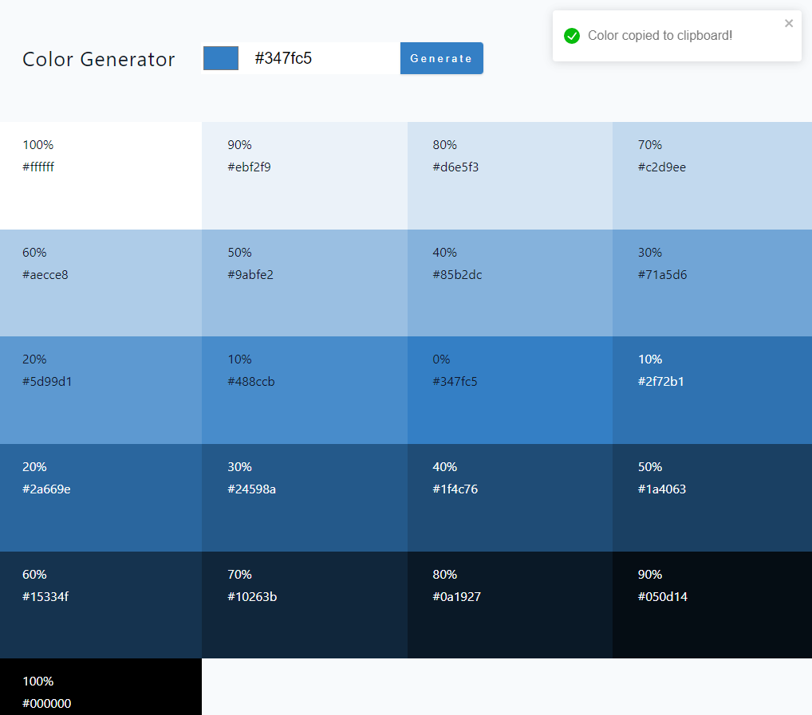

# Color Generator

Generate tint and shades from a color.

#### App Setup Command

```bash
npm install && npm run dev
```

#### Used Packages

- values.js

  - generate colors
  - control styling depending on color brightness

- react-toastify

  - prompt a popup when copy color to clipboard

- nanoid
  - generate unique id

#### Screenshot


